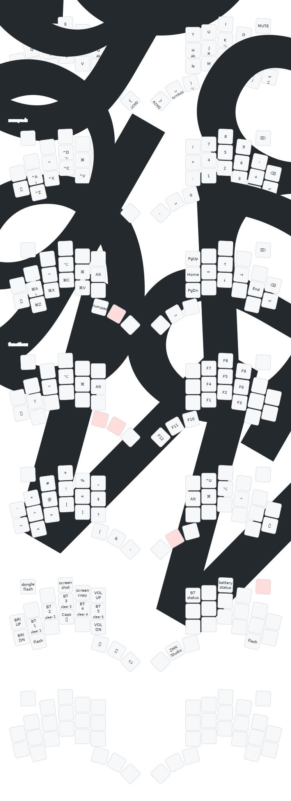

# Lintilla Keyboard ZMK Firmware

This repo contains the firmware for the [Lintilla Keyboard][lintilla].

To use it, follow the instructions for [creating your own ZMK firmware repo][zmk]
but note that the Lintilla keyboard is an out-of-tree keyboard so you will not
find it in the list of keyboards, but don't panic, we will make the necessary
changes to get it working.

Add this module to your `config/west.yml` by adding a new entry to both
`remotes` and `projects`:

```yaml
manifest:
  remotes:
    - name: zmkfirmware
      url-base: https://github.com/zmkfirmware
    - name: ctranstrum # <-- add this for the keyboard
      url-base: https://github.com/ctranstrum
    - name: caksoylar # <-- and this for the LED
      url-base: https://github.com/caksoylar
    - name: englmaxi # <-- if you want a dongle
      url-base: https://github.com/englmaxi
  projects:
    - name: zmk
      remote: zmkfirmware
      revision: main
      import: app/west.yml
    - name: lintilla # <-- add this for the keyboard
      remote: ctranstrum
      revision: zmk
    - name: zmk-rgbled-widget # <-- and this for the LED
      remote: caksoylar
      revision: main
    - name: zmk-dongle-dislay
      remote: englmaxi
      revision: main
  self:
    path: config
```

Then, choose one of the following to add to your `build.yaml` file:

For Lintilla with a dongle:

```yaml
include:
  - board: seeeduino_xiao_ble
    shield: lintilla_dongle dongle_display
    snippet: studio-rpc-usb-uart
    artifact-name: lintilla-dongle
  - board: seeeduino_xiao_ble
    shield: lintilla_left_peripheral rgbled_adapter
    artifact-name: lintilla-left
  - board: seeeduino_xiao_ble
    shield: lintilla_right_peripheral rgbled_adapter
    artifact-name: lintilla-right
```

Or for Lintilla without a dongle:

```yaml
include:
  - board: seeeduino_xiao_ble
    shield: lintilla_left_central rgbled_adapter
    snippet: studio-rpc-usb-uart
    artifact-name: lintilla-left
  - board: seeeduino_xiao_ble
    shield: lintilla_right_peripheral rgbled_adapter
    artifact-name: lintilla-right
```

If you want to use just the right side as a standalone macropad:

```yaml
include:
  - board: seeeduino_xiao_ble
    shield: lintilla_macro_right rgbled_adapter
    snippet: studio-rpc-usb-uart
    artifact-name: lintilla-macropad-right
```

To customize the keymap for your Lintilla board, you can copy the
[default keymap][keymap] from this repo to the `config` directory of
your zmk config repo and edit it from there.

To edit with ZMK Studio,
connect via USB,
fire up a Chrome browser,
and go to [https://zmk.studio](https://zmk.studio).

To edit with [Keymap Editor](https://nickcoutsos.github.io/keymap-editor/),
you'll need to copy over the [`lintilla.json`][info.json]
to the `config` directory of your repo.
You won't be able to use the default keymap as is,
because it uses custom pre-processing macros.
Either remove them by hand,
or instead start from [Optional's implementation][optional]
of the popular Miryoku layout.

Default keymap:



[keymap]: https://github.com/ctranstrum/lintilla/tree/zmk/boards/shields/lintilla/lintilla.keymap
[lintilla]: https://github.com/ctranstrum/lintilla
[zmk]: https://zmk.dev/docs/user-setup#github-repo
[info.json]: https://github.com/ctranstrum/lintilla/tree/zmk/config/lintilla.json
[optional]: https://github.com/OptionalM/zmk-config/tree/Miryoku_v1.0
# lintilla_zmk
